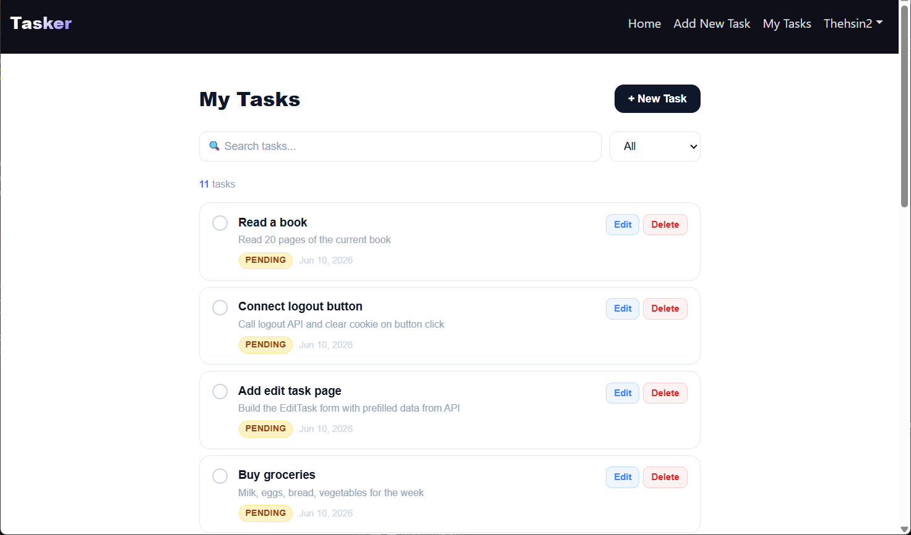
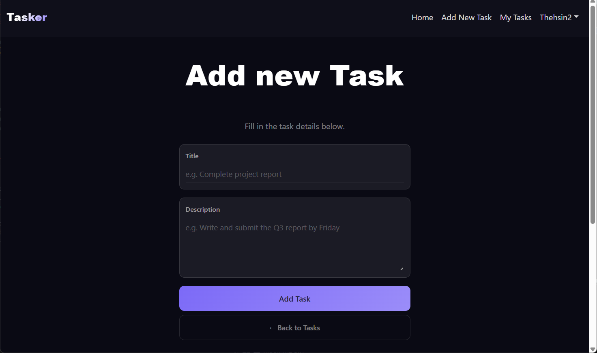
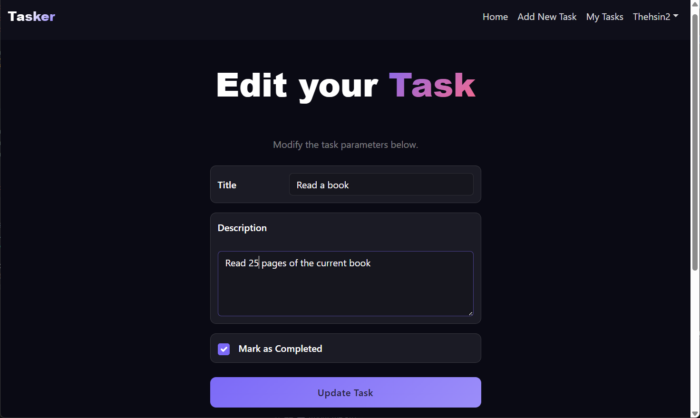
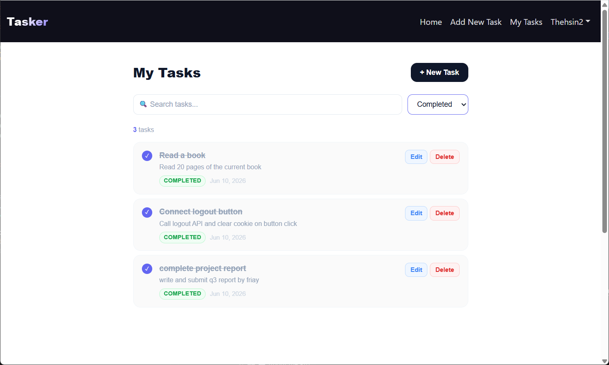
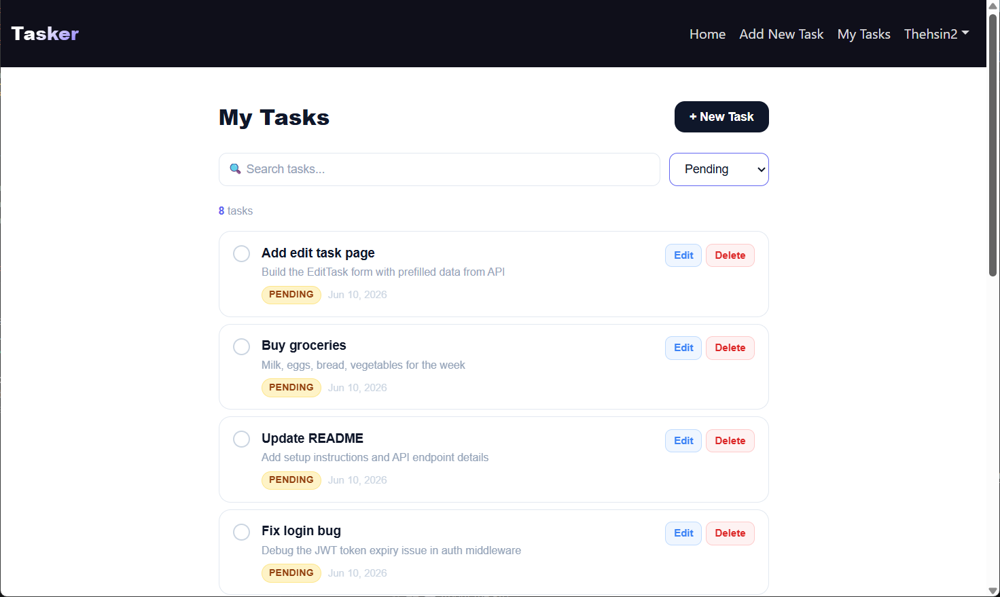
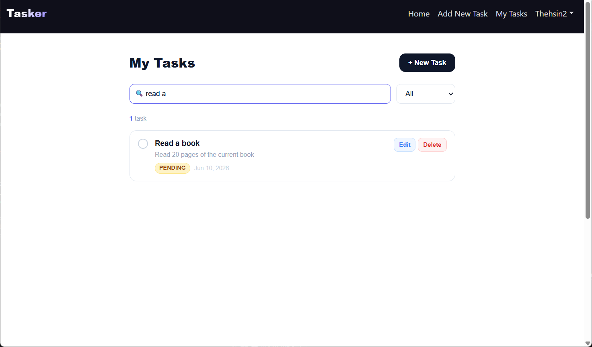
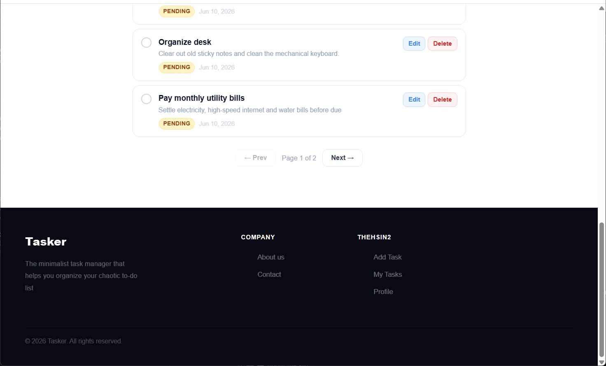

# Tasker — Task Manager

A simple task management app built with the MERN stack.

> Built with MongoDB · Express.js · React.js · Node.js

---

## Features

- Register and login securely
- Add, edit, and delete tasks
- Mark tasks as completed or pending
- Search and filter tasks
- Pagination

---

## Setup

### Backend
```bash
cd server
npm install
npm run dev
```

Create a `.env` file in the backend folder:
```env
PORT=4000
MONGO_URI=your_mongodb_uri
JWT_SECRET=your_secret_key
```

### Frontend
```bash
cd client
npm install
npm start
```

---

## API Routes

| Method | Route | Description |
|--------|-------|-------------|
| POST | `/api/auth/register` | Register |
| POST | `/api/auth/login` | Login |
| GET | `/api/tasks/getall` | Get all tasks |
| POST | `/api/tasks/add` | Add task |
| PUT | `/api/tasks/:id` | Update task |
| PATCH | `/api/tasks/:id/toggle` | Toggle status |
| DELETE | `/api/tasks/:id` | Delete task |

---
## Screenshots

### Home Page


### Task List


### Add Task


### Edit Task


### Filter,Search,Pagination







(https://github.com/thehzn)
